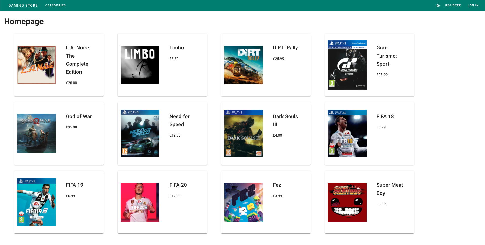

# Install guide
A list of instructions on how to run this project on your local machine.
## Server
Go into server folder.
Run `migrate-mongo up`to populate the database with products and categories (your MongoDB should be running on localhost:27017) and `npm start` to fire up a server

## Client
Move into client folder and run `npm run dev`
